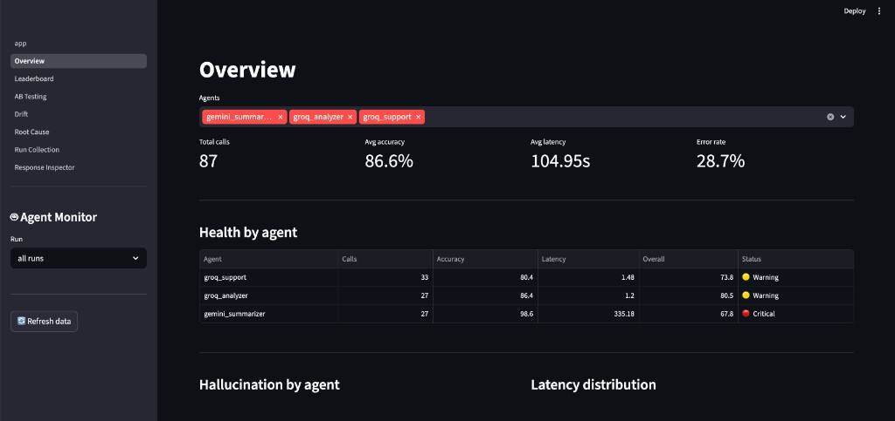
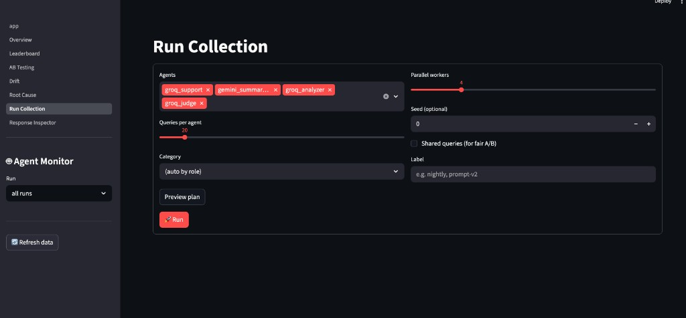
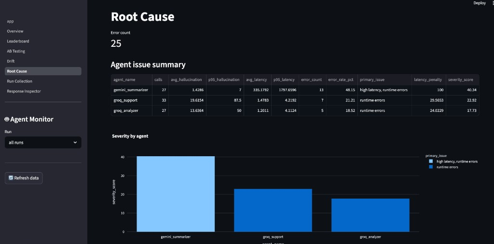

# AI Agent Evaluation Framework

A modular framework for evaluating and comparing AI agent performance across workflows.
The system collects outputs, scores responses, identifies failure patterns, and provides
visual dashboards to help teams choose reliable AI workflows before deployment.

## Why this tool exists

AI teams often run multiple agents, prompts, or workflows but lack a systematic way to evaluate them.

This framework helps teams:

- Compare agent outputs across experiments
- Detect hallucinations and failure patterns
- Score response quality
- Identify reliable workflows before deployment

The goal is to improve decision-making when building AI-powered products.

## System Architecture

The framework is composed of four modules:

- **Data collection** - capture agent responses across experiments
- **Evaluation layer** - scoring, validation, hallucination detection
- **Experiment tracking** - compare agent workflows and prompts
- **Visualization** - Streamlit dashboards for analysis

## Quick start

- Configure env vars from `.env.example`
- Configure agents in `config/agents.yaml`
- Configure settings in `config/settings.yaml`
- Run collection: `python -m agent_monitor.cli run -n 20 --label smoke`
- Run analysis: `python -m agent_monitor.cli analyze`
- Start dashboard: `streamlit run dashboard/app.py`

## Useful examples

- Fair A/B sample set: `python -m agent_monitor.cli run --role support --shared --seed 42 -n 30 --label prompt-ab`
- Dry-run plan preview: `python -m agent_monitor.cli run --agents groq_support --category edge_cases -n 20 --dry-run`
- Equivalent long flag for sample count: `python -m agent_monitor.cli run --n-per-agent 20 --dry-run`

## Quality checks

- Fast smoke checks after code changes: `pytest tests/test_smoke.py -x`
- Data quality checks after a collection run:
  - All data: `python validate.py --errors-only`
  - One run: `python validate.py --run <run_id> --errors-only`
- Strict CI-style gate: `pytest tests/test_smoke.py -x && python validate.py --errors-only`

## GTM Use Cases

- Evaluate AI support agents before customer deployment
- Compare onboarding assistant prompts for conversion impact
- Identify hallucination risks in customer-facing AI tools
- Benchmark multiple models or workflows during product launches

## Dashboard Screenshots

### Overview

### Run Collection

### Root Cause

